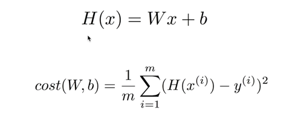
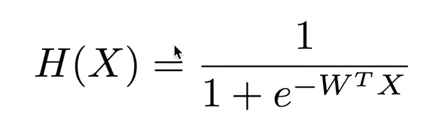
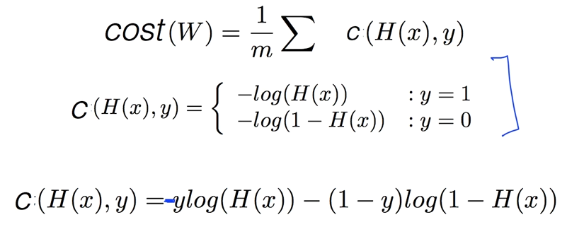
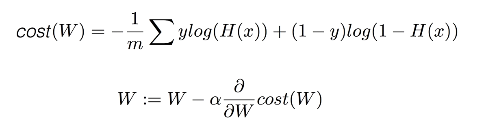
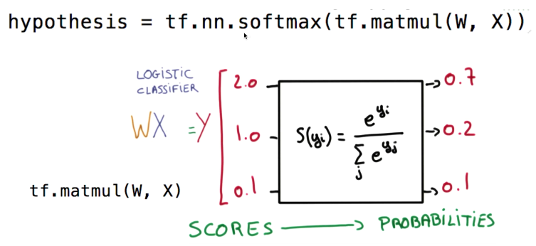
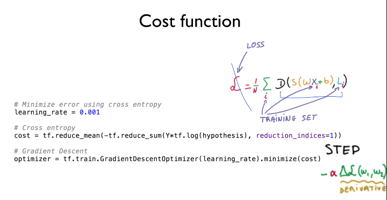
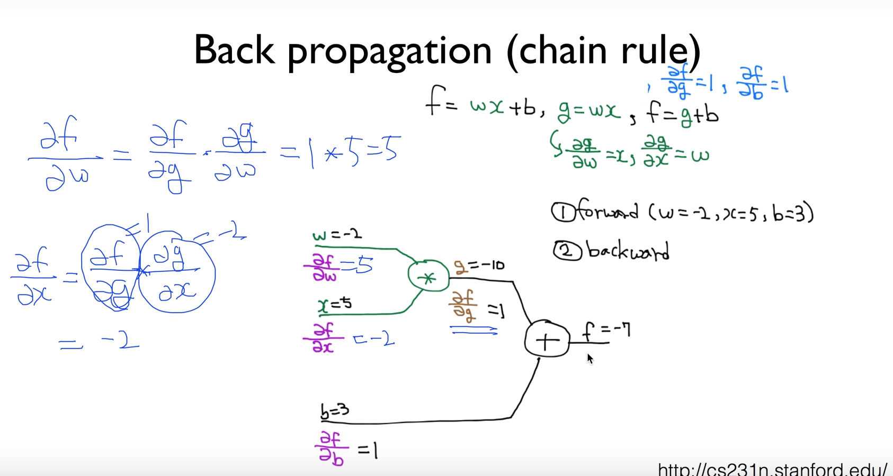
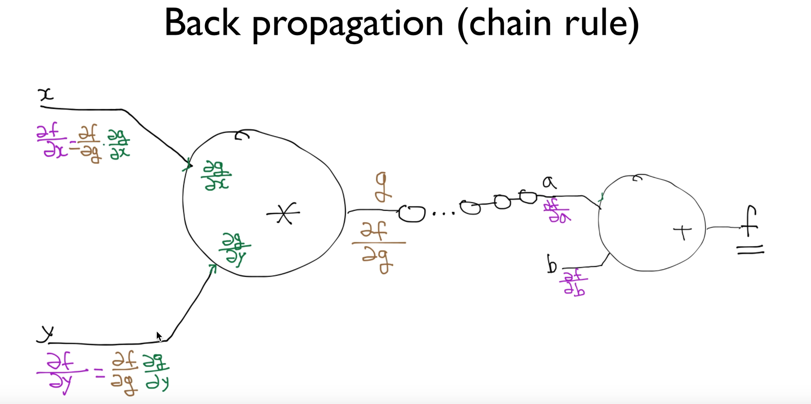
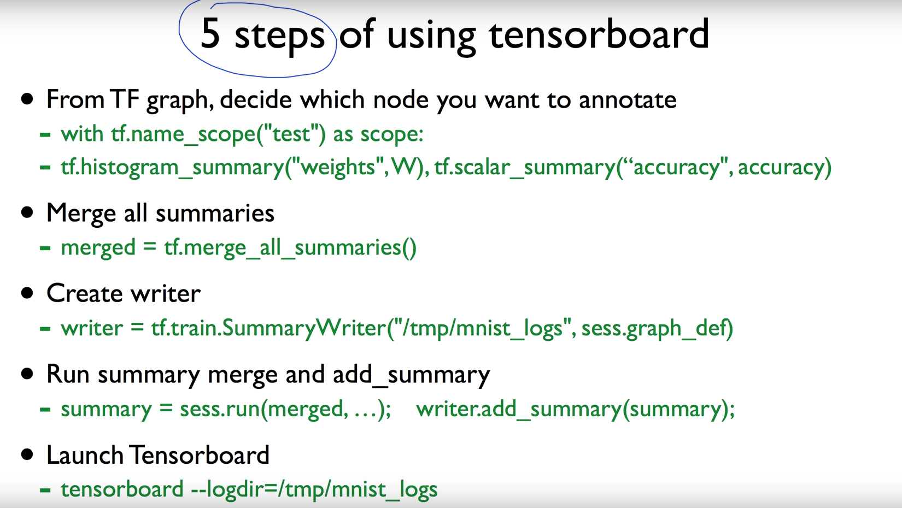

##	홍콩 과기대 김성훈 교수님의 수업.  [모두를 위한 머신러닝/딥러닝 강의] 공부 정리
##### - [https://hunkim.github.io/ml/](https://hunkim.github.io/ml/)
##### - Python(v3.5), window 10 64bit 환경에서 코딩.

#### 00. 개요.  
___  

+ **machine learning 이란?**   

	+ **Supervised learning**  
  		ex, Image labeling, Email spam filter, Predicting exam score  
  		type  
  			+ Predicting final exam score based on time spent - **regression**  
			+ Pass/non-pass based on time spent - **binary classification**  
			+ Letter grade(A, B, C, E and F) based on time spent - **multi-label classification**  

	+ **Unsupervised learning**  
		un-labeled data  

### 01. Linear regression
___  
+ **Goal: predicting**
+ Hypothesis and Cost(Loss) function  

+ Goal: Minimize cost  

		minimize cost(W, b)  
           W,b   

        Gradient descent algorithm  

### 02. Logistic Classification  
___  
+ **Goal: Spam Detection(Spam ot Ham), Facebook feed(show or hide), Credit Crad Fraud Detect(legitimate/fraud), Stock...**  

+ Hypothesis  

  

+ Cost function  
  

+ Goal: Minimize cost  
		
  

		Gradient descent algorithm  

### 03. Softmax classification: Multinomial classification  -> again  
여러개의 class가 있을때 그것을 예측.  like grade
___  

+ Hypothesis  

  

+ Cost function  

  

+ Goal: Minimize cost  

### 04. MNIST  

	...  

### 05. Neural Network  

	XOR  
	
	How can we learn W, and b from trading data?  -> !!!  
		Back propagarion(chain rule)  
  
  

### 06. TensorBoard  & Better Deep learning  

  

	learning_rate-> affect to cost step
	Data Preprocessing -> Standardzation ex, X_std[:,0] = (X[:,0] - X[:,0].mean()) / X[:,0].std()
	Online learning -> 

	Sigmoid -> ReLU ...  
	Weights -> RBM (Restricted Boltzmann Machine, encoder/decorder)  
			-> Xavier initialization  
	Overfitting -> More tranining data  
				-> reduce the number of features
				-> Regularization(not have too big numbers in the weight) -> l2reg  
				-> Dropout  
	Ensemble  

### 07. CNN (Convolutional Neural Network)  
	filters  
		Weights(depth), how many focus at once  
		output is one value  

	how many numbers can we get? (how many output with filter)  
		Output size:
			( (N - F) / stride ) + 1  

	Pad  
		block to small image , know the edge  
		add zero pad the border  
		make same input size and output size  

	How many weight variables?  
		ex. 5*5*3*6

	Pooling(sampling)  
		why sampling? -> make layer to smaller  
		max pooling  

### 08. RNN  (Recurrent Neural Network)  
	Sequence data  
	state
	
	ex.
		language Modeling  
		Speech Recognition  
		Machine Translation  
		Bot  
		image/video captioning  
	
	Algol:
		Long Short Term Memory (LSTM)  
		GRU  

### 09. Reinforcement Learning  
	Environment  
	Actor(Agent)  
	Action ->  
			<- state, reward  

### 10. Q-Learning  
	Q function  
		Q(state, action) -> quality(reward)  
	Policy  
		Max Q = maxQ(s, a)  
		π = argmaxQ(s, a)  
	How learn Q?
		Q(s, a) <- r + maxQ(s`, a`)  
	

